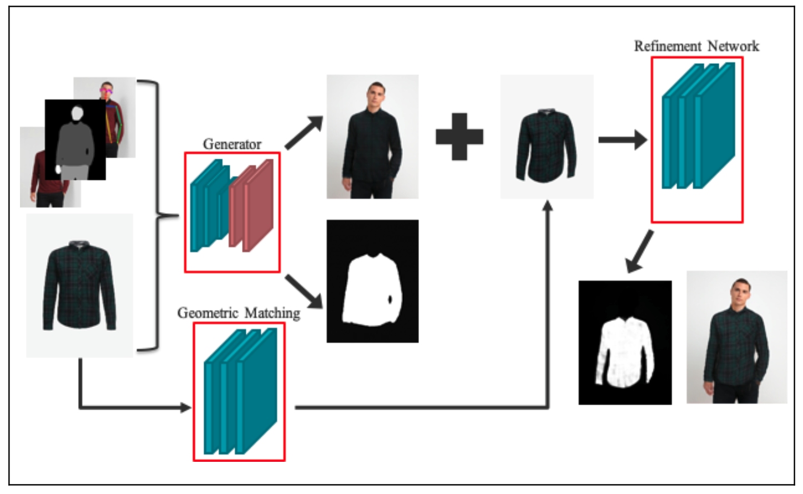
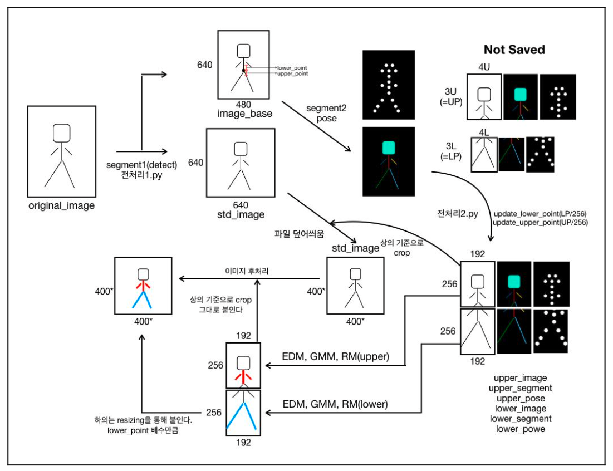
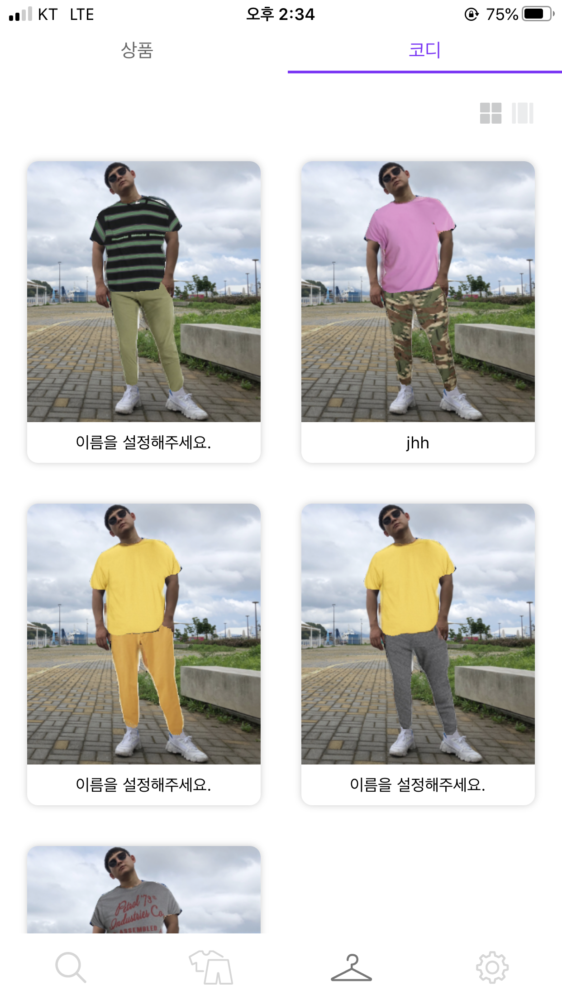
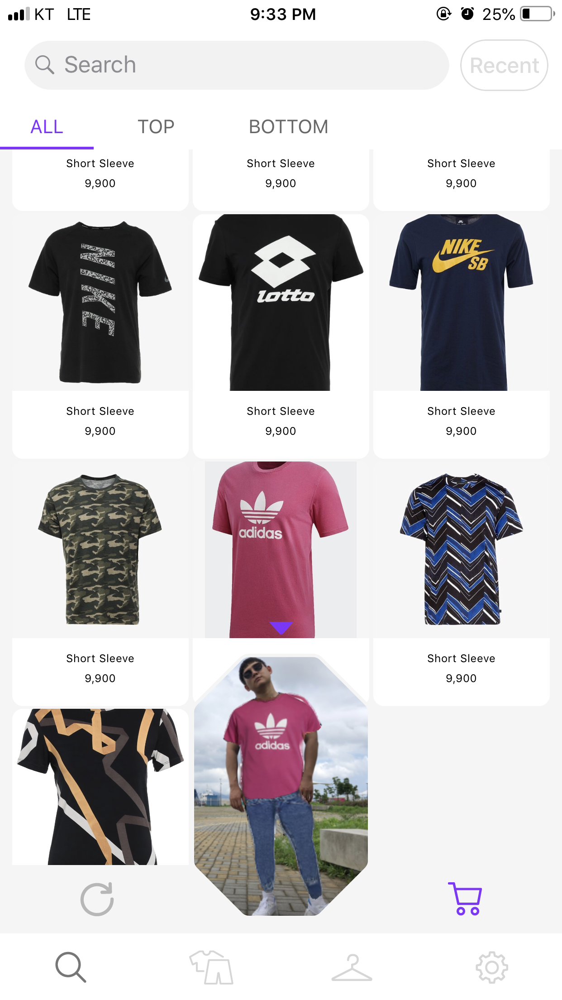
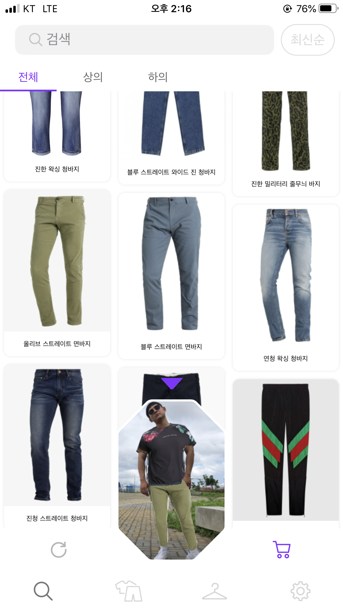

# EveryWear Model Server

## 아키텍처

EveryWear Model Server는 3가지 주요 모듈 (ew-synthesis, ew-fitting, ew-auth)과 Kafka로 구성됩니다.


각 모듈이 담당하는 역할은 다음과 같습니다.

| 모듈명       | 역할                                                                           |
|--------------|--------------------------------------------------------------------------------|
| ew-synthesis | TensorFlow Java API를 이용하여 딥러닝 모델을 인퍼런스하고 결과를 업로드합니다. |
| ew-fitting   | 피팅 API를 제공하고 FCM을 이용하여 합성 결과를 디바이스에 푸시합니다.          |
| ew-auth      | 클라이언트 앱이 토큰을 발급받고 피팅 API 요청시 해당 토큰을 검증합니다.        |

## 서버 실행하기

EveryWear Model Server 저장소를 Clone하고 빌드합니다.

### 1. 저장소 Clone

```bash
# 저장소 Clone
$ https://github.com/pirunita/everywear-model-server_public.git
```

### 2. 프로퍼티 설정

각 모듈의 `application.yml` 파일에서 프로퍼티를 설정합니다.

| 모듈명       | 프로퍼티명                                 | 설명                                     |
|--------------|--------------------------------------------|------------------------------------------|
| ew-synthesis | `jib.extras.saved-model-path`              | TensorFlow SavedModel 디렉토리 경로      |
| ew-fitting   | `jib.extras.firebase.service-account-file` | Firebase 서비스 계정 비공개 키 파일 경로 |

### 3. 서버 실행

Gradle Wrapper를 사용하여 EveryWear Model Server를 빌드하고 실행합니다.

```bash
# 각 모듈의 build/libs 경로에 jar 파일로 패키징
$ ./gradlew build

# ew-synthesis 모듈 실행
$ ./gradlew :ew-synthesis:bootRun

# ew-fitting 모듈 실행
$ ./gradlew :ew-fitting:bootRun
```

## Docker 이미지 만들기

### 1. 이미지에 포함할 파일 구성

- TensorFlow SavedModel 디렉토리를 `ew-synthesis/jib-extras` 위치에 놓습니다.

```
ew-synthesis
└── jib-extras
    └── savedmodel
        └── 1
            ├── saved_model.pb
            └── variables
                ├── variables.data-00000-of-00001
                └── variables.index
```

- Firebase 서비스 계정 비공개 키 파일을 `ew-fitting/jib-extras` 위치에 놓습니다.

```
ew-fitting
└── jib-extras
    └── everywear-239804-firebase-adminsdk-5njai-e50f36d65a.json
```

### 2. JVM 플래그 설정

`docker-compose.yml` 파일에서 플래그에 지정된 파일 경로가 맞는지 확인합니다.

| 플래그명                                   | 설명                                     |
|--------------------------------------------|------------------------------------------|
| `-Djib.extras.saved-model-path`              | TensorFlow SavedModel 디렉토리 경로      |
| `-Djib.extras.firebase.service-account-file` | Firebase 서비스 계정 비공개 키 파일 경로 |

### 3. jib 태스크 속성 설정

- 이미지를 빌드할 모듈 (ew-synthesis, ew-fitting)의 `build.gradle.kts` 파일에서 `jib.to.image` 속성을 자신의 Docker Hub ID로 수정합니다.

- Docker 이미지를 빌드하고 푸시합니다.

```bash
$ ./gradlew jib
```

### 4. 서버 실행

- `docker-compose.yml` 파일에서 `image` 프로퍼티에 방금 푸시한 저장소를 지정합니다.

- 푸시한 이미지를 이용하여 서버를 실행합니다.

```bash
$ docker-compose -f docker/docker-compose.yml up
```

# EVERWEAR Model

## 가상 피팅 서비스 딥러닝 모델 아키텍처


 모델 이름                   | 역할                                
--------------------------|------------------------------------------------------------------------------------------------------------------------------
Generator Model           | VITON을 참조한 Multi-taks Encoder-Decoder Generator model입니다. 사용자의 이미지, body segmentation, pose를 통해 중간 이미지를 생성합니다.
Geometric Matching Model  | CP-VTON을 참조한 Geometric Matching Model입니다. 사용자의 이미지, body segmentation, pose를 통해 옷 이미지를 적절히 warping 합니다.
Refinement Network Model  | VITON을 참조한 refinement network model입니다. Cascade Refinement Network (CRN)을 기반으로 하며, 중간 이미지와 warping cloth를 통해 질감과 음영이 살아있는 합성 이미지를 생성합니다.

<br><br>

## 상의 및 하의 후처리 알고리즘


<br>
<br>

* 합성하고자 하는 신체 영역만을 추출할 수 있도록 <b>OpenCV</b>​을 사용하여 Image Preprocessing을 통해 적절히 이미지를 분리하는 작업을 설계하였습니다. <u>​현재 상의와 하의 합성이 가능하여 크게 두
​부분으로 나누어 아키텍처를 설계​하였습니다.</u> 뿐만 아니라 여기에 사용된 Image Preprocessing Module을 활용하여 학습에 사용된 Dataset을 처리하는데도 사용하여 효율을 높였습니다.

* 합성결과를 다시 사용자의 전체 이미지를 붙이기 위한 Image Post-processing을 OpenCV로 구현하였습니다. 기존의 논문에서는 사용되지 않던 ​<br>warping binary mask</br>​를 Background로 사용하여 ​<u>합성된 이미지를 자연스럽게 전신에 붙일 수 있도록 구현​</u>하였습니다.

## 프로토타입





